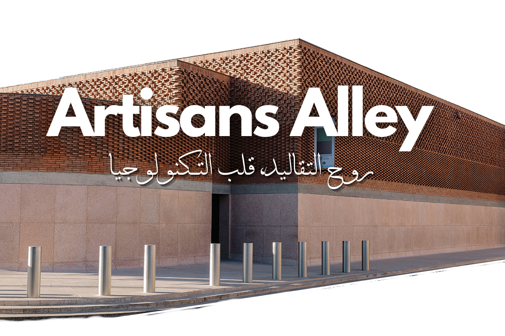

# ArtisansAlley

ArtisansAlley was developed as a project for the **ALX Software Engineering program** (Holberton School). It marks the end of the foundations period that lasted for 9 months and the start of the specialization period. The project was created by **Mahmoud Hammam** and **Youssef El Ghamour**.

## Introduction

Artisans Alley is a digital marketplace that serves as a digital gateway to traditional crafts, connecting artisans with customers worldwide. The platform provides a space for artisans to showcase their unique handmade products and for customers to discover and purchase authentic artisanal goods tailored to their preferences. Artisans Alley aims to digitize the traditional artisanal market, empowering artisans to reach a wider audience and enabling customers to find high-quality handmade items with ease.

Artisans Alley offers a variety of features tailored to both artisans and customers, including:

- **Artisan Profiles:** Artisans can create profiles/shops to showcase their craft, upload product images, and provide detailed descriptions.
- **Product Listings:** Artisans can list their handmade products with prices.
- **Customer Orders:** Customers can browse products, place orders.
- **Search and Filter:** Users can explore the products and artisans, and filter search results based on their crafts and cities/countries.
- **User Authentication:** Role-based user authentication system ensures secure access to platform features for artisans and customers.

## Technologies Used

ArtisansAlley is built using the following technologies:

- **Python:** Main programming language for backend development.
- **Flask:** Lightweight web framework for building web applications in Python.
    - **Flask-WTF:** Extension for Flask that simplifies form handling and validation.
    - **Flask-Bcrypt:** Extension for Flask that provides bcrypt hashing utilities for the passwords.
    - **Flask-Login:** Extension for Flask that provides user session management, including login and logout functionality.
- **MySQL:** Relational database management system for data storage.
- **SQLAlchemy:** Python SQL toolkit and ORM for interacting with MySQL databases.
- **HTML/CSS:** Frontend development and styling.
- **Jinja:** Templating engine for generating dynamic HTML content.
- **JavaScript:** Programming language for adding interactivity to web pages.
- **jQuery:** JavaScript library for simplifying client-side scripting.
- **Git:** Version control system for tracking changes in codebase.
- **Visual Studio Code:** Integrated development environment (IDE) for coding.

## Setup

To set up ArtisansAlley locally, follow these steps:

1. Clone the repository: `git clone https://github.com/youssefelghamour/ArtisansAlley.git`
2. Navigate to the project directory: `cd ArtisansAlley`
3. Install dependencies: `pip install -r requirements.txt`
4. Set up MySQL database: `cat setup_mysql_dev.sql | mysql -hlocalhost -uroot -p`
5. Run the Flask application: `python -m web_flask.flask_app`
6. Run the API in a seperate terminal: `python -m api.v1.app`
6. Access the application in your web browser at `http://localhost:5000`
7. You can run the sql dump `echo dump8.sql | mysql -uroot -p artall_db` to generate some data.

## Usage

Once ArtisansAlley is set up, you can use the following steps to interact with the platform:

1. Sign up as an artisan or customer to create an account.
2. As an artisan, create a profile with your info and list your handmade products with details.
3. As a customer, browse products, add them to cart, and place orders, and write reviews to products.

## Next Step

As we look to the future, we envision expanding ArtisansAlley into a thriving community where artisans can connect, collaborate, and grow their businesses. We plan to incorporate features such as real-time messaging, personalized recommendations, and enhanced analytics to further enrich the user experience.

## Authors

- Mahmoud Hammam - [Github](https://github.com/MahmoudHammam0)
- Youssef El Ghamour - [Github](https://github.com/youssefelghamour)